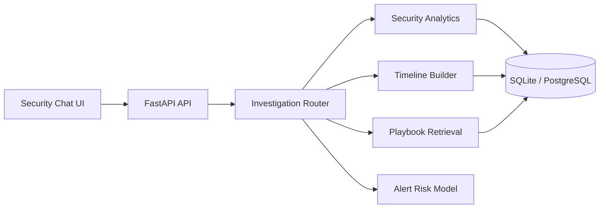

# SentinelOps AI

[](https://github.com/fullstackwithai/SentinelOps/actions/workflows/ci.yml)


**SentinelOps AI** is an agentic cybersecurity incident-response copilot that helps analysts investigate authentication telemetry, retrieve response playbooks, build evidence timelines, and score suspicious alerts with explainable machine learning.

It is designed as a practical AI/ML engineering portfolio project rather than a generic chat wrapper. Every investigation response exposes the tool used, the evidence collected, and the reasoning path presented to the analyst.

## What SentinelOps demonstrates

- Agentic investigation workflows with visible tool traces
- Failed-login spike analysis by identity and source IP
- High-risk event triage and chronological incident timelines
- Retrieval over incident-response playbooks
- Explainable alert-risk classification
- FastAPI backend services and typed API contracts
- SQLAlchemy with SQLite and PostgreSQL-compatible configuration
- pandas and scikit-learn preprocessing, training, evaluation, persistence, and inference
- Docker, automated tests, GitHub Actions, and API documentation
- Honest use of clearly labeled synthetic security data

## Architecture



## Core investigation flow

1. The analyst submits a natural-language security question.
2. The investigation router selects a bounded tool.
3. The selected tool analyzes events, retrieves a playbook, builds a timeline, or runs ML inference.
4. SentinelOps returns the result together with structured evidence and a visible execution trace.
5. The analyst retains responsibility for interpretation and response decisions.

## Quick start

```bash
python -m venv .venv

# Windows
.venv\Scripts\activate

# macOS/Linux
source .venv/bin/activate

pip install -r requirements.txt
cp .env.example .env
uvicorn app.main:app --reload
```

Open `http://localhost:8000`.

Interactive API documentation is available at `http://localhost:8000/docs`.

## Recommended demo prompts

- `Show failed-login spikes by user and IP.`
- `Which events are high risk?`
- `Build an investigation timeline.`
- `Which playbook applies to credential compromise?`
- `Train the alert-risk model.`
- `Predict whether a suspicious alert is malicious.`

## API surface

| Method | Endpoint | Purpose |
|---|---|---|
| `GET` | `/api/health` | Service status |
| `GET` | `/api/stats` | Security workspace metrics |
| `POST` | `/api/chat` | Agentic investigation chat |
| `GET` | `/api/sessions/{id}` | Investigation history |
| `POST` | `/api/playbooks` | Validate and index a response playbook |
| `GET` | `/api/playbooks` | List indexed playbooks |
| `GET` | `/api/timeline` | Build an event timeline |
| `POST` | `/api/ml/train` | Train and evaluate the classifier |
| `POST` | `/api/ml/predict` | Score an alert and explain contributing factors |

## Machine-learning transparency

The included alert classifier is trained on synthetic demonstration data. Its purpose is to demonstrate feature preprocessing, model evaluation, persistence, inference, risk bands, and explainable outputs. The repository does not claim production detection efficacy.

## Security and governance

SentinelOps is a portfolio demonstration, not a production SOC platform. It does not replace analyst judgment or established incident-response procedures.

Implemented safeguards include bounded tools, input validation, environment-based secrets, visible evidence traces, synthetic demonstration data, and documented production-hardening requirements.

See [SECURITY.md](SECURITY.md) for details.

## Tests

```bash
pytest -q
```

The automated suite covers service health, dashboard statistics, agent traces, playbook retrieval, model training, inference, and upload validation.

GitHub Actions also compiles the Python source and runs the test suite on every push and pull request targeting `main`.

## Docker

```bash
docker compose up --build
```

The application is then available at `http://localhost:8000`.

## Application narrative

A ready-to-use 3–6 paragraph project explanation is included in [docs/PROJECT_EXPLANATION.md](docs/PROJECT_EXPLANATION.md).

## Author

**Arsim Shefkiu**  
AI Software Engineer | Full-Stack Developer | SaaS & Automation

## License

MIT License. Copyright © 2026 Arsim Shefkiu.
