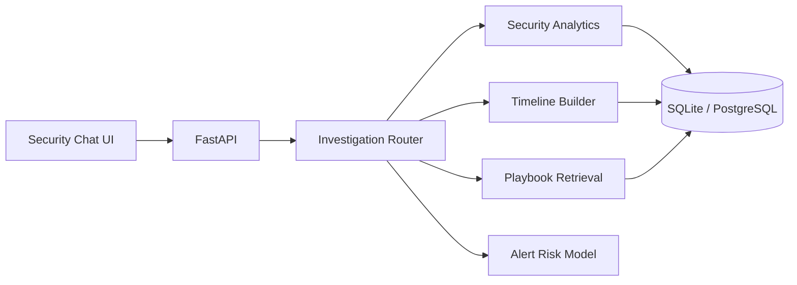

# SentinelOps AI

[](https://github.com/USERNAME/sentinelops-ai/actions/workflows/ci.yml)


**SentinelOps AI** is an agentic cybersecurity incident-response copilot that investigates authentication telemetry, retrieves response playbooks, builds evidence timelines, and scores suspicious alerts with explainable machine learning.

## Why it stands out

This is not a generic chatbot wrapper. It demonstrates a complete applied AI workflow across security analytics, retrieval, agent orchestration, backend APIs, databases, and ML inference.

- Conversational investigation with visible tool evidence
- Failed-login spike analysis by identity and source IP
- High-risk event triage and chronological timelines
- Incident-response playbook retrieval
- Explainable alert-risk classification
- Synthetic security-event dataset with honest labeling
- FastAPI, SQLAlchemy, SQLite/PostgreSQL, pandas, scikit-learn
- Docker, automated tests, GitHub Actions, and API documentation

## Architecture



## Quick start

```bash
python -m venv .venv
# Windows
.venv\Scripts\activate
# macOS/Linux
source .venv/bin/activate

pip install -r requirements.txt
cp .env.example .env
uvicorn app.main:app --reload
```

Open `http://localhost:8000`. API documentation is available at `http://localhost:8000/docs`.

## Demo prompts

- `Show failed-login spikes by user and IP.`
- `Which events are high risk?`
- `Build an investigation timeline.`
- `Which playbook applies to credential compromise?`
- `Train the alert-risk model.`
- `Predict whether a suspicious alert is malicious.`

## API surface

| Method | Endpoint | Purpose |
|---|---|---|
| `GET` | `/api/health` | Service status |
| `GET` | `/api/stats` | Security workspace metrics |
| `POST` | `/api/chat` | Agentic investigation chat |
| `GET` | `/api/sessions/{id}` | Investigation history |
| `POST` | `/api/playbooks` | Index a response playbook |
| `GET` | `/api/playbooks` | List indexed playbooks |
| `GET` | `/api/timeline` | Build an event timeline |
| `POST` | `/api/ml/train` | Train and evaluate the classifier |
| `POST` | `/api/ml/predict` | Score an alert |

## ML transparency

The included alert classifier is trained on synthetic demonstration data. Its purpose is to show preprocessing, evaluation, persistence, inference, and explainable outputs. The repository does not claim real-world detection efficacy.

## Tests

```bash
pytest -q
```

The suite covers health, dashboard data, agent traces, playbook retrieval, model training, inference, and upload validation.

## Security scope

This repository is a portfolio demonstration, not a production SOC platform. See [SECURITY.md](SECURITY.md) for implemented controls and production hardening requirements.

## Application narrative

A ready-to-use project explanation is included in [docs/PROJECT_EXPLANATION.md](docs/PROJECT_EXPLANATION.md).

## Author

**Arian Shefkiu**  
AI Software Engineer | Full-Stack Developer | SaaS & Automation
